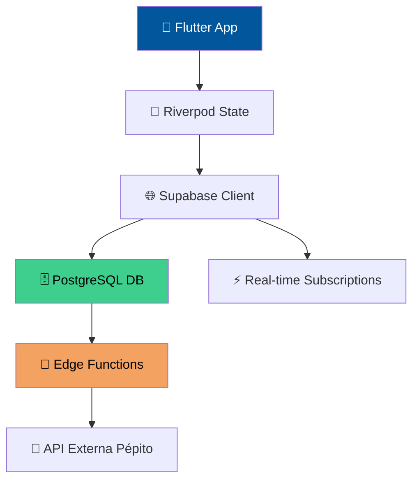

# 🐱 Pépito Updates

<div align="center">


**Monitorea a tu gato en tiempo real desde cualquier lugar del mundo 🌍**

[📱 Descargar](#-instalación) • [📊 Demo](#-características) • [🤝 Contribuir](#-contribuir)

</div>

---

## 📖 Sobre Pépito

Pépito es un gato aventurero que sale y entra de casa cuando quiere. Esta aplicación te permite saber **exactamente dónde está** y **qué está haciendo** tu felino amigo en tiempo real.

> *"¿Dónde está Pépito?"* - Ahora tienes la respuesta al instante ⚡

---

## ✨ Características

### 🏠 Monitoreo Inteligente
- **Estado en tiempo real**: ¿Pépito está dentro o fuera?
- **Historial completo**: Todas las entradas y salidas registradas
- **Notificaciones inteligentes**: Alertas cuando Pépito llega o se va

### 📊 Estadísticas Avanzadas
- **Gráficos interactivos**: Tendencia de actividad semanal
- **Análisis por hora**: ¿Cuándo es más activo Pépito?
- **Patrones de comportamiento**: Descubre los hábitos de tu gato

### 🎨 Experiencia Premium
- **Multiplataforma**: Android, iOS, Web, Windows, macOS, Linux
- **Temas adaptativos**: Claro/oscuro automático
- **Interfaz intuitiva**: Diseño moderno y responsive
- **Multiidioma**: Español e Inglés

---

## 🏗️ Arquitectura



### Tecnologías Core

| Componente | Tecnología | Propósito |
|------------|------------|-----------|
| **Frontend** | Flutter + Dart | UI multiplataforma |
| **Backend** | Supabase | Base de datos + API |
| **Estado** | Riverpod | Gestión reactiva |
| **Gráficos** | FL Chart | Visualización de datos |
| **Tiempo Real** | WebSockets | Actualizaciones live |

---

## 🚀 Instalación

### Prerrequisitos
- Flutter 3.8+
- Dart 3.0+
- Git

### Pasos Rápidos

```bash
# 1. Clona el repositorio
git clone https://github.com/xNekom/PepitoUpdates.git

# 2. Entra al directorio
cd PepitoUpdates

# 3. Instala dependencias
flutter pub get

# 4. Configura Supabase (ver SUPABASE_SETUP.md)

# 5. Ejecuta la app
flutter run
```

> 💡 **Tip**: Para desarrollo web, usa `flutter run -d chrome`

---

## 📱 Uso

### Pantalla Principal
- **Estado actual** de Pépito con indicador visual
- **Última actividad** con timestamp
- **Historial reciente** de movimientos

### Estadísticas
- **Gráfico semanal**: Actividad por día
- **Gráfico horario**: Actividad por hora del día
- **Insights inteligentes**: Patrones detectados automáticamente

### Configuración
- **Tema**: Cambia entre claro y oscuro
- **Idioma**: Español o Inglés
- **Notificaciones**: Personaliza las alertas

---

## 🎯 Casos de Uso

- **Dueños preocupados**: Siempre saben dónde está su gato
- **Familias**: Compartan el estado de Pépito con todos
- **Veterinarios**: Analicen patrones de comportamiento
- **Cuidadores**: Monitoreen mascotas ajenas

---

## 🤝 Contribuir

¡Las contribuciones son bienvenidas! 🐱

1. **Fork** el proyecto
2. Crea tu rama: `git checkout -b feature/AmazingFeature`
3. **Commit** tus cambios: `git commit -m 'Add AmazingFeature'`
4. **Push** a la rama: `git push origin feature/AmazingFeature`
5. Abre un **Pull Request**

### Áreas de contribución
- 🐛 **Bug fixes**
- ✨ **Nuevas funcionalidades**
- 📱 **Mejoras de UI/UX**
- 🌍 **Nuevos idiomas**
- 📊 **Nuevos tipos de gráficos**

---

## 📄 Licencia

Este proyecto está bajo la **Licencia MIT**. Ver [`LICENSE`](LICENSE) para más detalles.

---

## 🙏 Agradecimientos

- **Pépito** por ser la inspiración 🐱
- **Flutter** por la mejor framework multiplataforma
- **Supabase** por el backend perfecto
- **Comunidad Open Source** por hacer posible todo esto

---

<div align="center">

**Hecho con ❤️ para Pépito y todos los gatos del mundo**

⭐ **Si te gusta el proyecto, ¡dale una estrella!**

[🐱 Conoce más sobre Pépito](https://github.com/xNekom) • [📧 Contacto](mailto:pepito@example.com)

</div>